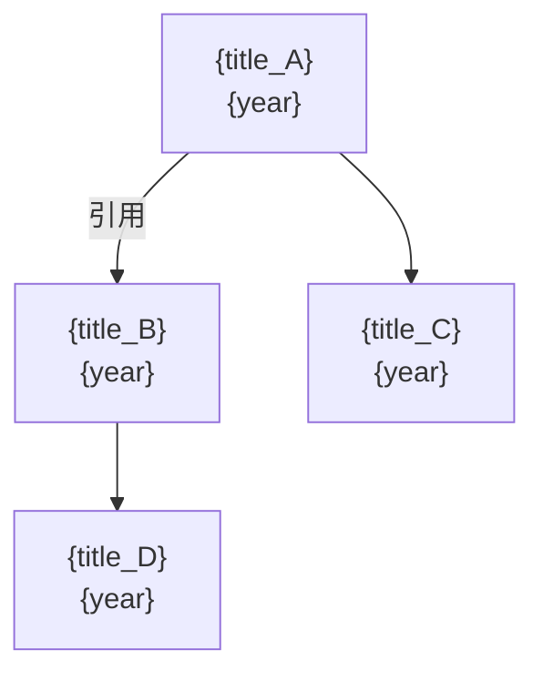

# paper-cite Skill

构建论文**引用关系图**，发现知识演化脉络，定位领域关键节点。
职责边界：分析引用关系与知识传承，不做全文提取，不做相关性评分。

---

## 输入格式

```
INPUT_TYPES:
  A. 单篇论文（URL / 标题 / PAPER_SCHEMA）→ 以该论文为起点展开
  B. 多篇论文列表 → 分析列表内部引用关系
  C. 研究方向关键词 → 先搜索奠基论文，再展开图

ANALYSIS_GOAL（从用户意图推断）:
  "ancestry"    → 向上追溯：这篇论文的思想从哪里来
  "influence"   → 向下追溯：这篇论文影响了哪些后续工作
  "landscape"   → 全景图：某领域的引用网络结构
  "path"        → 路径分析：从方法 A 到方法 B 的演化路径
```

---

## 核心概念定义

```
GRAPH_CONCEPTS:

  节点 (Node):
    paper_id:    string
    title:       string
    year:        int
    citations:   int
    node_type:   "seed" | "ancestor" | "descendant" | "sibling"
    importance:  float   # 0.0-1.0，见评分方法

  边 (Edge):
    source:      paper_id   # 引用者
    target:      paper_id   # 被引用者
    edge_type:   "direct_cite" | "method_inherit" | "dataset_reuse" | "claim_challenge"
    strength:    "strong" | "weak"   # strong=核心引用, weak=背景引用

  关键节点类型:
    "Founder"    : 被引用数最高的早期论文（引用图的根）
    "Bridge"     : 连接两个子方向的节点
    "Breakthrough": 引用数在发表后快速增长的论文
    "Dead End"   : 被引用少，未产生后续影响
```

---

## 执行流程

### Step 1 — 种子论文确认

```
IF input is URL/title:
    fetch paper metadata (title, year, references, citations)
    seed_papers = [this_paper]

IF input is keyword:
    web_search(keyword + "survey" OR "foundational paper")
    seed_papers = top 3 most-cited results
```

---

### Step 2 — 图展开（BFS，按 analysis_goal 控制方向）

```
EXPANSION_RULES:

  ancestry (向上):
    从 seed 出发，获取其 references
    对每个 reference，递归获取其 references
    最大深度：3层 | 每层最多展开：10篇
    优先展开：引用数最高 + 时间最早的节点

  influence (向下):
    从 seed 出发，搜索 "citing papers"
    优先展开：引用数增长最快 + 时间最新的节点
    最大深度：2层 | 每层最多展开：15篇

  landscape:
    合并 ancestry(depth=2) + influence(depth=1)
    额外添加：与 seed 高度共引的 sibling 节点

  path:
    给定 paper_A 和 paper_B
    找到从 A 到 B 的引用路径（若存在）
    或找到最近共同祖先 (LCA)
```

**数据获取方式**（使用 `web_search` + `web_fetch`）：

```
获取 references: web_fetch(semantic_scholar_api + paper_id + "/references")
获取 citations:  web_fetch(semantic_scholar_api + paper_id + "/citations")
备用:            web_search(title + "references" OR "cited by")
```

---

### Step 3 — 节点重要性评分

```
IMPORTANCE_SCORE:
  base        = log(citations + 1) / log(max_citations_in_graph + 1)
  structural  = (in_degree + out_degree) / max_degree_in_graph   # 图中连接度
  temporal    = 1.0 if is_earliest_in_cluster else 0.5           # 时间先驱奖励
  bridge_bonus = 0.3 if connects_two_communities else 0.0

  importance = 0.4*base + 0.3*structural + 0.2*temporal + 0.1*bridge_bonus
```

---

### Step 4 — 社区检测

将图中的论文自动聚类为子方向：

```
CLUSTERING_METHOD:
  按方法相似性（标题/摘要关键词聚类）分组
  每个 cluster 命名为其最高引用论文的核心方法名
  标注 cluster 间的 Bridge 节点

OUTPUT:
  clusters: [
    {name: "Attention Mechanism", papers: [...], founder: "Attention is All You Need"},
    {name: "RLHF", papers: [...], founder: "InstructGPT"},
    ...
  ]
```

---

### Step 5 — 时间线生成

```
TIMELINE:
  按年份排列所有节点
  标注每年的"最重要突破"（importance > 0.7 的节点）
  标注技术范式转移点（某年后新方法引用量超过旧方法）
```

---

### Step 6 — 输出生成

#### 引用关系总览

```markdown
## 引用关系图：{topic}

> 分析范围：{total_nodes} 篇论文 · {total_edges} 条引用关系
> 时间跨度：{earliest_year} – {latest_year}
> 分析类型：{analysis_goal}

### 关键节点（按重要性排序）

| 论文 | 年份 | 引用数 | 节点类型 | 重要性 |
|------|------|--------|----------|--------|
| **{title}** | {year} | {citations} | Founder | {importance} |
...

### 子方向聚类

**{cluster_name}** ({n} 篇)
- 奠基论文：{founder}
- 代表工作：{key_papers}
- 与其他子方向的桥接：通过 {bridge_paper} 连接到 {other_cluster}
```

#### 技术演化时间线

```markdown
### 技术演化时间线

{year_start}  ▶ **{paper_A}** — 提出 {method}，成为该方向起点
   ↓
{year_mid}    ▶ **{paper_B}** — 在 {method} 基础上引入 {improvement}
   ↓
{year_now}    ▶ **{paper_C}** — 当前 SOTA，{key_advance}

[范式转移点] {year}: {paper} 发表后，引用量超越 {old_method}，
             标志着从 {old_paradigm} 到 {new_paradigm} 的转变
```

#### 引用路径（path 模式）

```markdown
### 从 {paper_A} 到 {paper_B} 的演化路径

{paper_A} ({year_A})
  └─引用─▶ {paper_mid_1} ({year}) — 继承了 {what}
              └─引用─▶ {paper_mid_2} ({year}) — 发展了 {what}
                          └─引用─▶ {paper_B} ({year_B})

共同祖先：{LCA_paper} ({year})，被两篇论文共同引用
```

#### Mermaid 图（可渲染）

```markdown
### 可视化引用图


```

---

## 质量自检

```
QUALITY_CHECKLIST:
  [ ] 所有引用关系来自可验证来源（Semantic Scholar / 原文参考文献）
  [ ] 节点重要性分值有计算依据，非主观判断
  [ ] 时间线中的"转折点"有引用数据支撑
  [ ] Bridge 节点的跨子方向连接已验证
  [ ] 图中无孤立节点（所有节点至少有一条边）
  [ ] 论文标题准确，无捏造
```

---

## 与 Agent 的接口契约

**输入**：
```json
{
  "skill": "paper-cite",
  "params": {
    "seed_papers": ["arxiv_id_or_title"],
    "analysis_goal": "ancestry",
    "max_depth": 3,
    "max_nodes": 30
  }
}
```

**输出**：
```json
{
  "graph": {
    "nodes": [NODE_SCHEMA],
    "edges": [EDGE_SCHEMA],
    "clusters": [CLUSTER_SCHEMA]
  },
  "timeline": [{year, paper_id, event_type}],
  "key_nodes": {
    "founders": [paper_id],
    "bridges": [paper_id],
    "breakthroughs": [paper_id]
  },
  "rendered_markdown": "string"
}
```

---

## 边界与限制

- **引用数据依赖 Semantic Scholar**：部分论文数据可能不完整
- **向下追溯（influence）覆盖有限**：新论文的引用尚未被完整收录
- **不做全文分析**：引用关系判断基于元数据，不读全文
- **图规模限制**：最多展开 50 个节点，超出则截断并提示使用 Research 功能

---

## 示例调用

**用户输入**：`帮我追溯一下 LoRA 这个方法的技术来源，想了解它的思想是怎么演化来的`

**执行过程**：
1. 搜索 "LoRA Low-Rank Adaptation" 获取种子论文
2. analysis_goal = "ancestry"，向上追溯 3 层
3. 发现关键祖先：Adapter Tuning → Intrinsic Dimensionality → LoRA
4. 生成时间线 + 引用路径 + Mermaid 图
5. 标注 Bridge 节点（连接 PEFT 与 Matrix Factorization 子方向）
